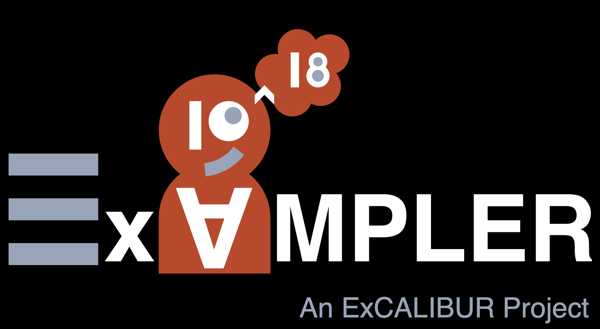
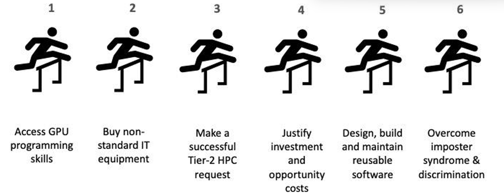
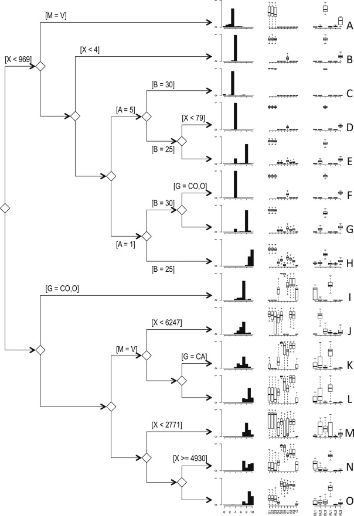
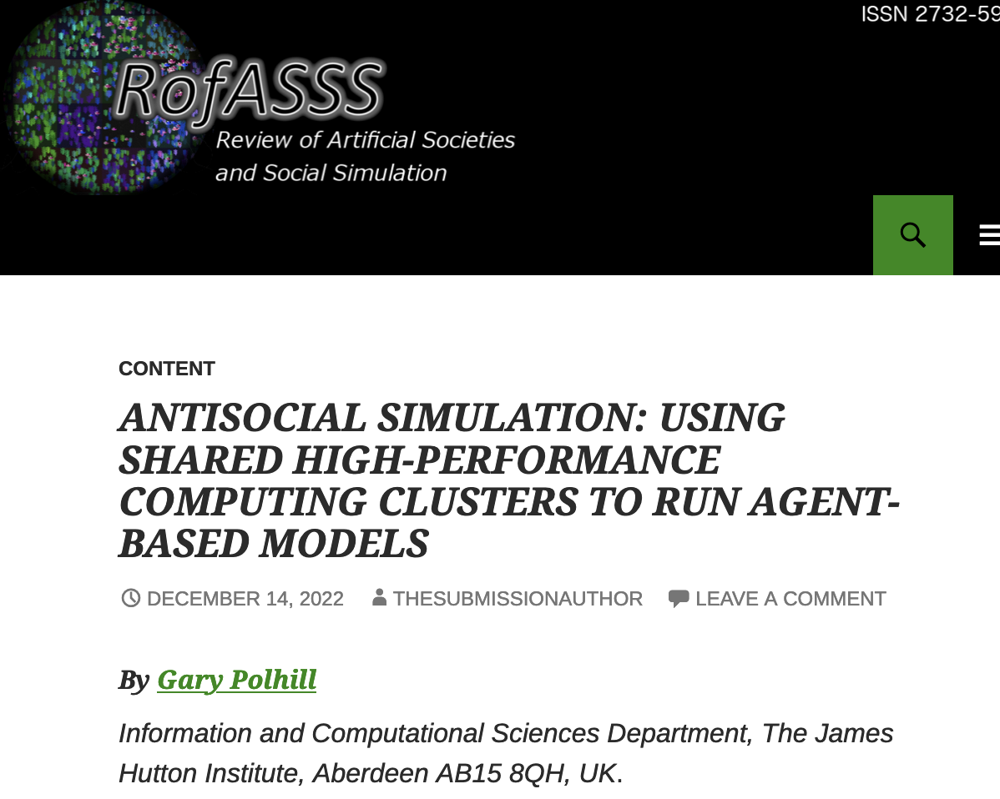

<!-- .slide: class="title-slide" -->
# Why ABM needs HPC
## Gary Polhill1 &amp; Alison Heppenstall2

1 The James Hutton Institute
2 University of Glasgow

  

  

---

# What is High-Performance Computing?

  + High-Performance Computing provides its users with access to far greater computing resource than is available on a personal computing device

    + Personal computers are capable of about 1bn floating-point operations per second (gigascale)
    + Local or institutional HPC infrastructure allows you access to about 1000 times that (terascale)
    + National HPC infrastructure is generally 1000 times more... (petascale)
    + The USA, Europe, Japan, China, and the UK already have, or will soon have exascale computing infrastructure

  + Some personal computers with expensive graphics cards can also scale up computation rates _if they are carefully programmed_

  + Exascale computing typically relies on efficient GPU programming to achieve these speeds
    
    + Most HPC infrastructure is generally CPU-based, but newer systems include significant GPU provision, and some are exclusively so

---

<!-- .slide: class="right-image-slide" -->

# The ExAMPLER project

  + Funded by the Engineering and Physical Sciences Research Council under the ExCALIBUR Programme, the ExAMPLER project explored what needed to be done to get agent-based models using exascale compute

  + Our main finding is that we need to increase our HPC (and GPU) use

    + Typical-case ABM is still personal computer based (Polhill et al., under revision)

    + (Strictly, typical-case ABM doesn't report the computing environment...)

 

---

# ExAMPLER project findings

We also found that there are many hurdles faced by the social simulation community when accessing HPC resources

--- 

<!-- .slide: class="right-image-slide" -->

# Use cases of HPC with ABMs

  + Work using HPC and GPUs includes

    + Polhill et al. (2013) _Environmental Modelling &amp; Software_ &mdash; roughly 22000 runs of the FEARLUS-SPOMM agent-based model to explore principles for incentivizing biodiversity

    + Axtell (2016) _AAMAS_ &mdash; simulates 120 million agents (citizens and businesses) in the US economy on a GPU

    + Joubert et al. (2022) _Computers, Environment &amp; Urban Systems_ &mdash; model street robbery in Cape Town at a high resolution using a hybrid CPU/GPU simuation environment; it still takes several days for each simulation to complete!

---

# Potential of HPC with ABMs

  + Regional, national and international-scale simulations
    + Town / small city scale more common currently
    + _Northern Powerhouse_ in the UK would involve several cities &mdash; Leeds, Sheffield, Manchester, Liverpool
    + More generally: if we build infrastructure _here_ what is the effect on people _there_ (100+km away)

  + Calibration &mdash; an 'embarrassingly parallel' problem perfect for HPC
    + If I can explore 100 parameter samples on my laptop, I can do 100,000,000 samples on national HPC infrastructure!
    + Better calibrated models are easier to trust

  + Similarly for uncertainty analysis

  + Better exploration of formalized social theories
    + Searching all the alternative representations rather than just one implementation with many arbitrary choices...

---

<!-- .slide: class="right-image-slide" -->

# Access to HPC for ABMs

  + See Polhill (2022)

  + Sound theoretical reasons why agent-based models are difficult to use in environments where RAM and CPU time need to be predicted

    + Birth and death of agents
    + Creation and destruction of social links
    + Context sensitive decision-making algorithms (e.g. CONSUMAT)

  + Technical reasons too &mdash; _must_ we access HPC by command-line?

 

